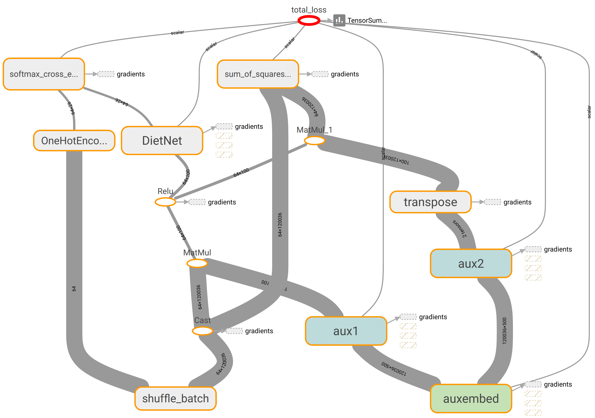

# Diet Networks: Thin Parameters for Fat Genomics

Unofficial implementation of [diet networks](http://openreview.net/forum?id=Sk-oDY9ge) in TensorFlow.



## Requirements:

- Python 2.7 or 3.5
- [TensorFlow](https://www.tensorflow.org) >= 0.12rc0. See [installation instructions](https://www.tensorflow.org/versions/r0.11/get_started/os_setup.html#pip-installation).
- numpy
- [plinkio](https://pypi.python.org/pypi/plinkio) (only for preprocessing) Install via pip e.g. `pip install plinkio`
- [plink2](https://www.cog-genomics.org/plink2) (only for preprocessing) This can be easily installed via [Bioconda](http://bioconda.github.io) e.g. `conda install -c bioconda plink2`
- [pandas](http://pandas.pydata.org/) (only for preprocessing)


## Usage:

- Install the requirements above. Use plink2numpy to preprocess PLINK files and run dietnet script with `--prefix` option.
- To reproduce 1000G results, run `make` command in `1000G` folder. (~700MB file will be downloaded) Then run `./dietnet --prefix 1000G/genotypes`
- See command line arguments for available options:

```
usage: dietnet [-h] [--prefix PREFIX] [--batchsize BATCHSIZE]
               [--hiddensize HIDDENSIZE] [--embeddingsize EMBEDDINGSIZE]
               [--learningrate LEARNINGRATE] [--gamma GAMMA]
               [--numclasses NUMCLASSES] [--aux [AUX]] [--noaux]
               [--autoencoder [AUTOENCODER]] [--noautoencoder]
               [--embeddingtype EMBEDDINGTYPE]
               [--shareembedding [SHAREEMBEDDING]] [--noshareembedding]

optional arguments:
  -h, --help            show this help message and exit
  --prefix PREFIX       Prefix of inputs e.g. genotypes if files are named genotypes_x.npy
  --batchsize BATCHSIZE
                        Batch size
  --hiddensize HIDDENSIZE
                        Size of hidden layers
  --embeddingsize EMBEDDINGSIZE
                        Size of embedding layers
  --learningrate LEARNINGRATE
                        Learning rate
  --gamma GAMMA         Loss weight of autoencoder
  --numclasses NUMCLASSES
                        Total number of classes
  --aux [AUX]           Use auxiliary networks to reduce number of parameters.
  --noaux
  --autoencoder [AUTOENCODER]
                        Enable autoencoder
  --noautoencoder
  --embeddingtype EMBEDDINGTYPE
                        Type of embedding: Only raw_end2end supported.
  --shareembedding [SHAREEMBEDDING]
                        Share embeddings of auxiliary nets
  --noshareembedding
```

## TODO:

- Dropout
- Bias terms for We and Wd
- ~~Summary ops and tensorboard screenshots. also misclass. err~~
- K-fold CV
- Make train and predict subcommands e.g. add placeholders
- Other embeddings: random projection, histogram
- SNP2vec
